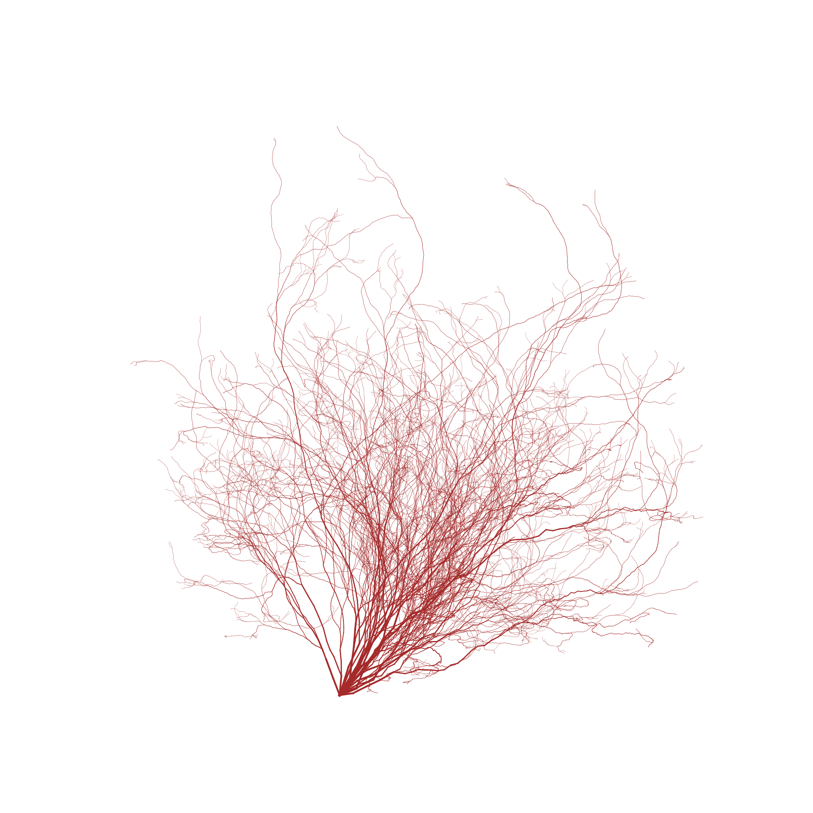

# random-branching

To run the code you only need to install [nix](https://nixos.org/download.html). Then run this command from project directory:

```shell
$ nix-shell --pure --command 'python main.py'
```


